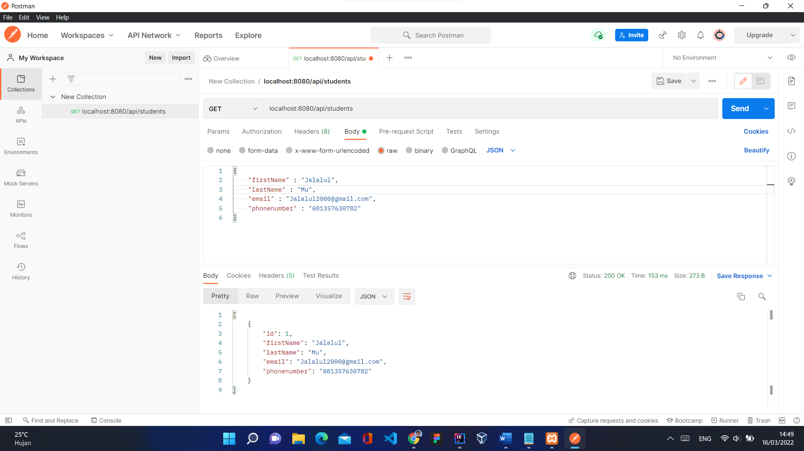
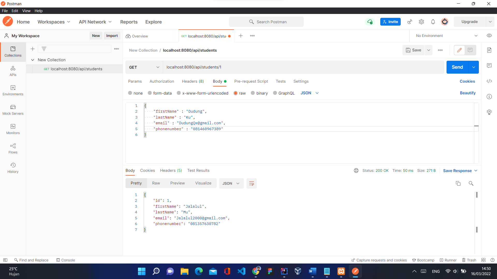
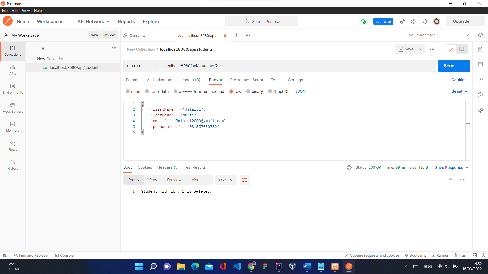
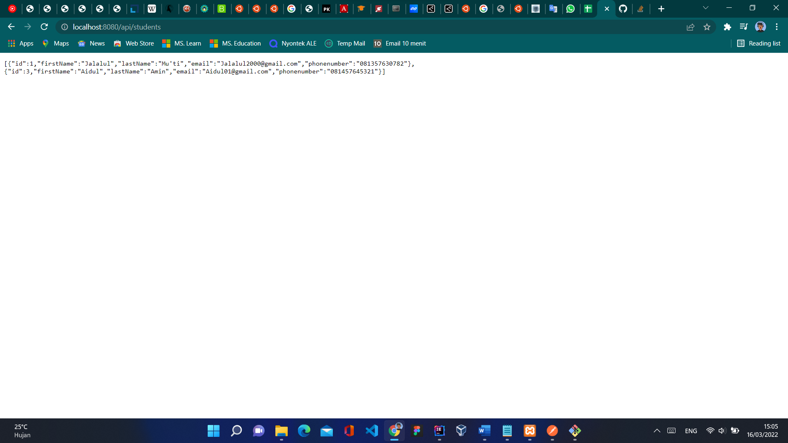

# Pertemuan3_PBO

POST MAPPING
 "Menambah Data Student"

GET MAPPING
 "Menampilkan/Mengambil Semua Data Student"

PUT MAPPING
 "Update Data Student"

GET BY ID
 "Menampilak/Mengambil Data Student Berdasarkan ID"

DELETE BY ID
 "Menghapus Data Student Berdasarkan ID"

LAYOUT HASIL
 "Tampilan Localhost/8080/api/student"
